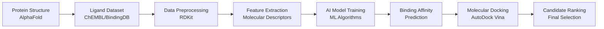

# 🧬 AI-Assisted Drug Design for Asthma Treatment

<div align="center">

**Computational Drug Discovery Pipeline for β2-Adrenergic Receptor (ADRB2)**

[](https://opensource.org/licenses/MIT)
[](https://www.python.org/)
[](https://vina.scripps.edu/)

</div>

---

## 📋 Overview

This project implements an end-to-end AI-powered computational drug discovery pipeline targeting the **Beta-2 Adrenergic Receptor (ADRB2)**, a critical protein in asthma treatment. By combining machine learning with molecular docking simulations, we accelerate the identification of potential drug candidates.

### 🎯 Key Features

- 🤖 **Machine Learning Models** - Predict binding affinity of novel molecules
- 🔬 **Molecular Docking** - Simulate protein-ligand interactions using AutoDock Vina
- 📊 **Large-Scale Screening** - Process thousands of compounds efficiently
- 🧪 **Data-Driven Discovery** - Leverage ChEMBL and BindingDB datasets
- 📈 **Intelligent Ranking** - Combine AI predictions with docking scores

---

## 🎯 Target Protein Information

| Property | Details |
|----------|---------|
| **Protein Name** | Beta-2 Adrenergic Receptor |
| **Gene Name** | ADRB2 |
| **UniProt ID** | [P07550](https://www.uniprot.org/uniprotkb/P07550) |
| **Target Disease** | Asthma |
| **Function** | Bronchodilation - relaxes airway smooth muscles |
| **Structure Source** | [AlphaFold Database](https://alphafold.ebi.ac.uk/) |

---

## 🔄 Pipeline Workflow



### Pipeline Steps

1. **Protein Structure Acquisition** - Download ADRB2 structure from AlphaFold/UniProt
2. **Ligand Dataset Collection** - Gather known binders from ChEMBL and BindingDB
3. **Data Preprocessing** - Clean and standardize molecular structures
4. **Feature Engineering** - Extract molecular descriptors using RDKit
5. **Model Training** - Train ML models on binding affinity data
6. **Prediction** - Score novel candidate molecules
7. **Molecular Docking** - Validate predictions with AutoDock Vina
8. **Ranking & Selection** - Identify top drug candidates

---

## 📁 Repository Structure

```
ai_assisted_drug_design/
│
├── 📂 data/
│   ├── raw/                    # Raw datasets from ChEMBL/BindingDB
│   └── processed/              # Cleaned and preprocessed data
│
├── 📂 protein/
│   └── beta2_receptor.pdb      # ADRB2 protein structure
│
├── 📂 ligands/
│   ├── sdf/                    # Ligands in SDF format
│   └── pdbqt/                  # Ligands in PDBQT format (docking-ready)
│
├── 📂 ai_model/
│   ├── train.py                # Model training script
│   ├── predict.py              # Prediction script
│   └── model.pkl               # Trained model checkpoint
│
├── 📂 docking/
│   ├── vina_config.txt         # AutoDock Vina configuration
│   └── results/                # Docking output files
│
├── 📂 results/
│   └── final_hits.csv          # Top-ranked drug candidates
│
├── 📂 notebooks/
│   └── exploration.ipynb       # Data exploration and visualization
│
├── requirements.txt            # Python dependencies
└── README.md                   # This file
```

---

## 🤖 Role of Artificial Intelligence

Our AI models learn patterns from existing drug-receptor interactions to predict binding affinity of new molecules before expensive experimental validation.

### Benefits

✅ **Speed** - Screen thousands of molecules in minutes  
✅ **Efficiency** - Reduce computational costs by 10-100x  
✅ **Intelligence** - Learn complex molecular patterns  
✅ **Prioritization** - Focus experimental resources on best candidates

### ML Algorithms Used

- 🌲 **Random Forest** - Ensemble learning for robust predictions
- 🧠 **Neural Networks** - Deep learning for complex patterns
- 🚀 **Gradient Boosting** - XGBoost/LightGBM for high accuracy

---

## 🔬 Role of AutoDock Vina

AutoDock Vina performs **molecular docking** to simulate how drug molecules bind to the ADRB2 receptor.

### What Docking Provides

- 🎯 **Binding Pose** - Optimal orientation of drug in protein pocket
- 📊 **Binding Affinity** - Estimated strength of interaction (kcal/mol)
- ⚡ **Energy Score** - Lower scores = stronger binding

> **Note:** Docking scores typically range from -5 to -15 kcal/mol for drug-like molecules. Scores < -8 kcal/mol indicate promising candidates.

---

## ⚙️ Installation

### Prerequisites

- Python 3.8 or higher
- AutoDock Vina (for molecular docking)
- Git

### Setup Instructions

1. **Clone the repository**
```bash
git clone https://github.com/kabhishek3001/ai_assisted_drug_design.git
cd ai_assisted_drug_design
```

2. **Create virtual environment** (recommended)
```bash
python -m venv venv
source venv/bin/activate  # On Windows: venv\Scripts\activate
```

3. **Install Python dependencies**
```bash
pip install -r requirements.txt
```

4. **Install AutoDock Vina**
```bash
# Linux/Mac
conda install -c conda-forge autodock-vina

# Or download from: https://vina.scripps.edu/downloads/
```

---

## 🚀 Usage

### 1. Train the AI Model

```bash
python ai_model/train.py --data data/processed/training_set.csv --output ai_model/model.pkl
```

### 2. Predict Binding Affinity

```bash
python ai_model/predict.py --model ai_model/model.pkl --ligands ligands/sdf/ --output results/predictions.csv
```

### 3. Run Molecular Docking

```bash
vina --config docking/vina_config.txt --out docking/results/docking_output.pdbqt
```

### 4. Explore Results in Jupyter

```bash
jupyter notebook notebooks/exploration.ipynb
```

---

## 📊 Input & Output Files

### Inputs

| File | Description |
|------|-------------|
| `protein/beta2_receptor.pdb` | ADRB2 protein structure |
| `data/raw/*.csv` | Ligand datasets from databases |
| `ligands/sdf/*.sdf` | Compound structures in SDF format |

### Outputs

| File | Description |
|------|-------------|
| `ai_model/model.pkl` | Trained ML model |
| `docking/results/*.pdbqt` | Docking poses and scores |
| `results/final_hits.csv` | Top-ranked drug candidates |

---

## 🎓 Applications

This pipeline can be applied to:

- 💊 **Drug Discovery** - Identify novel therapeutics
- 🔬 **Academic Research** - Study protein-ligand interactions
- 📚 **Educational Projects** - Learn computational drug design
- 🏥 **Pharmaceutical Development** - Accelerate early-stage discovery

---

## 📈 Future Enhancements

- [ ] Implement deep learning models (Graph Neural Networks)
- [ ] Add ADMET (Absorption, Distribution, Metabolism, Excretion, Toxicity) prediction
- [ ] Integrate molecular dynamics simulations
- [ ] Build web interface for easy access
- [ ] Support multi-target drug design

---

## 📄 License

This project is licensed under the MIT License - see the [LICENSE](LICENSE) file for details.

---

## ⚠️ Disclaimer

**Important:** This project is for **research and educational purposes only**. It is not intended for clinical use or medical diagnosis. All predictions and results should be validated through proper experimental procedures before any therapeutic application.

---

## 👨‍💻 Author

**Abhishek Kumar**

- GitHub: [@kabhishek3001](https://github.com/kabhishek3001)
- Project Link: [AI-Assisted Drug Design](https://github.com/kabhishek3001/ai_assisted_drug_design)

---

## 🙏 Acknowledgments

- [AlphaFold](https://alphafold.ebi.ac.uk/) - Protein structure prediction
- [ChEMBL](https://www.ebi.ac.uk/chembl/) - Bioactivity database
- [AutoDock Vina](https://vina.scripps.edu/) - Molecular docking software
- [RDKit](https://www.rdkit.org/) - Cheminformatics toolkit

---

<div align="center">

**⭐ If you find this project useful, please consider giving it a star! ⭐**

Made with ❤️ for advancing computational drug discovery

</div>
